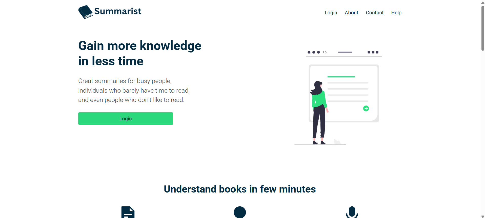

# 📚 Summarist Virtual Internship

## 🚀 Overview

A full-stack book summary platform where users can create accounts, browse books via API integration, and access audio and written summaries with authentication and dynamic state management.

## What it does

Full-stack book summary platform with Firebase authentication, Stripe-gated premium content, and audio playback. Users browse a library of titles, read or listen to summaries, and upgrade to a paid plan — all managed through Redux-driven state and a Next.js App Router frontend.

## 🛠 Tech Stack

* Next.js
* React
* Redux
* Firebase
* Stripe
* HTML
* CSS
* Vercel

## 🌐 Live Demo

[https://virtual-internship-summarist-uw2o.vercel.app/](https://virtual-internship-summarist-uw2o.vercel.app/)

## 🛠️ Run Locally

```bash
npm install
npm run dev
```
